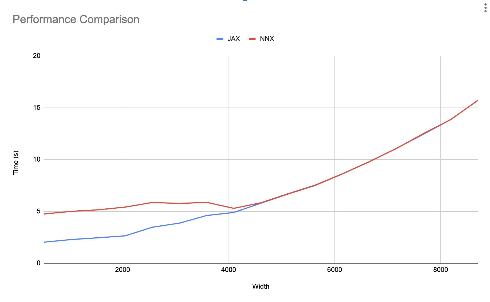

---
jupytext:
  formats: ipynb,md:myst
  text_representation:
    extension: .md
    format_name: myst
    format_version: 0.13
    jupytext_version: 1.13.8
---

# Performance considerations

Currently, Flax [`nnx.jit`](https://flax.readthedocs.io/en/latest/api_reference/flax.nnx/transforms.html#flax.nnx.jit) traverses the object graph in pure Python, which is slow and adds overhead. This is why in order to solve this the Flax team will be developing a Rust extension called `flaxlib` to speed up some of the traversal logic in [`graph.py`](https://github.com/google/flax/blob/main/flax/nnx/graph.py). This will be similar to how the JAX team resolved a similar issue by introducing [`jaxlib`](https://jax.readthedocs.io/en/latest/installation.html#installation) for standard [JAX pytrees](https://jax.readthedocs.io/en/latest/key-concepts.html#pytrees) (refer to the first steps in [Flax PR #4196](https://github.com/google/flax/pull/4196)).

However, there are two things to consider:

* The overhead is only relevant for small models (refer to [Asynchronous dispatch](#asynchronous-dispatch).
* You can remove the overhead by using [`jax.jit`](https://jax.readthedocs.io/en/latest/_autosummary/jax.jit.html) + [`flax.nnx.split`](https://flax.readthedocs.io/en/latest/api_reference/flax.nnx/graph.html#flax.nnx.split) / [`flax.nnx.merge`](https://flax.readthedocs.io/en/latest/api_reference/flax.nnx/graph.html#flax.nnx.merge) to stage out the traversal logic (Refer to [Lowering the Python overhead](#lowering-the-python-overhead).


## Asynchronous dispatch

In [benchmarks/nnx_simple_training.py](https://github.com/google/flax/blob/main/benchmarks/nnx_simple_training.py) we are increasing the layer width (features per layer) and measuring the total training time for the same model trained both with [`nnx.jit`](https://flax.readthedocs.io/en/latest/api_reference/flax.nnx/transforms.html#flax.nnx.jit) and [`jax.jit`](https://jax.readthedocs.io/en/latest/_autosummary/jax.jit.html).

As demonstrated in the graph below, after a certain model size the time spent in the traversal is completely absorbed by async dispatch. This happens when Python is able to finish the current for loop step, and reach the next `train_step` and JAX is still not done with the previous `train_step`. 



This means that you only need to worry about the `nnx.jit` overhead for small models. If you are working with a small model, check out the next section to see how you can remove the overhead.

## Lowering the Python overhead

To remove the Python overhead, you can use regular `jax.jit` in combination with `nnx.split` and `nnx.merge` to stage out the traversal logic.

To learn how to do this, let’s first create the following simple `Model`:

```{code-cell}
from flax import nnx
import jax
import jax.numpy as jnp
import optax

class Model(nnx.Module):
  def __init__(self, din, dmid, dout, rngs: nnx.Rngs):
    self.linear = nnx.Linear(din, dmid, rngs=rngs)
    self.bn = nnx.BatchNorm(dmid, rngs=rngs)
    self.dropout = nnx.Dropout(0.2, rngs=rngs)
    self.linear_out = nnx.Linear(dmid, dout, rngs=rngs)

  def __call__(self, x):
    x = nnx.relu(self.dropout(self.bn(self.linear(x))))
    return self.linear_out(x)
```

Next, let’s create a `train_step()` function that uses [`nnx.jit`](https://flax.readthedocs.io/en/latest/api_reference/flax.nnx/transforms.html#flax.nnx.jit), taking in the `model`, `optimizer`, and `metrics`, all of which are Flax NNX objects:

```{code-cell}
model = Model(2, 64, 3, rngs=nnx.Rngs(0))  # eager initialization
optimizer = nnx.Optimizer(model, optax.adam(1e-3))  # reference sharing
metrics = nnx.MultiMetric(
  loss=nnx.metrics.Average('loss'),
)

@nnx.jit  # <== currently slow
def train_step(model, optimizer, metrics, x, y):
  def loss_fn(model):
    y_pred = model(x)  # call methods directly
    return ((y_pred - y) ** 2).mean()

  loss, grads = nnx.value_and_grad(loss_fn)(model)
  optimizer.update(grads)  # in-place updates
  metrics.update(loss=loss)

  return loss
  
for _ in range(10):
  x, y = jnp.ones((32, 2)), jnp.zeros((32, 3))
  loss = train_step(model, optimizer, metrics, x, y)
```

To speed this up, before starting the training loop we can use [`nnx.split`](https://flax.readthedocs.io/en/latest/api_reference/flax.nnx/graph.html#flax.nnx.split) over all the Flax NNX objects that are inputs to `train_step()` to create `graphdef` and `state` pytrees that are faster to traverse.

Next, we change `train_step()` to accept `graphdef` and `state`, and use [`nnx.merge`](https://flax.readthedocs.io/en/latest/api_reference/flax.nnx/graph.html#flax.nnx.merge) and [`nnx.split`](https://flax.readthedocs.io/en/latest/api_reference/flax.nnx/graph.html#flax.nnx.split) at the beginning and the end of `train_step()` to switch back and forth between the objects and their pytree representations. And even though `nnx.split` and `nnx.merge` are slow, it doesn't matter because they will run only once during tracing.

With this in place, we can change the `train_step()` function to use `jax.jit` instead of `nnx.jit`:

```{code-cell}
model = Model(2, 64, 3, rngs=nnx.Rngs(0))  # eager initialization
optimizer = nnx.Optimizer(model, optax.adamw(1e-3))  # reference sharing
metrics = nnx.MultiMetric(
  loss=nnx.metrics.Average('loss'),
)
# split before training loop
graphdef, state = nnx.split((model, optimizer, metrics))

@jax.jit  # regular JAX
def train_step(graphdef, state, x, y):
  # merge at the beginning of the function
  model, optimizer, metrics = nnx.merge(graphdef, state)

  def loss_fn(model):
    y_pred = model(x)  # call methods directly
    return ((y_pred - y) ** 2).mean()

  loss, grads = nnx.value_and_grad(loss_fn)(model)
  optimizer.update(grads)
  metrics.update(loss=loss)

  # split at the end of the function
  _, state = nnx.split((model, optimizer, metrics))

  # return new state
  return state, loss

for _ in range(10):
  x, y = jnp.ones((32, 2)), jnp.zeros((32, 3))
  state, loss = train_step(graphdef, state, x, y)

# update objects after training
nnx.update((model, optimizer, metrics), state)
```

Notice that we only do this for `jit`. You can still use other [Flax transforms](https://flax.readthedocs.io/en/latest/guides/transforms.html#transformations) like [`nnx.value_and_grad`](https://flax.readthedocs.io/en/latest/api_reference/flax.nnx/transforms.html#flax.nnx.value_and_grad) shown in the above example since their overhead is already absorbed by the outer `jit`.

And after the training loop is done (or whenever it is needed), we can use Flax [`nnx.update`](https://flax.readthedocs.io/en/latest/api_reference/flax.nnx/graph.html#flax.nnx.update) to update Flax NNX objects like `model`, `optimizer`, and `metrics` to a new `state`.
